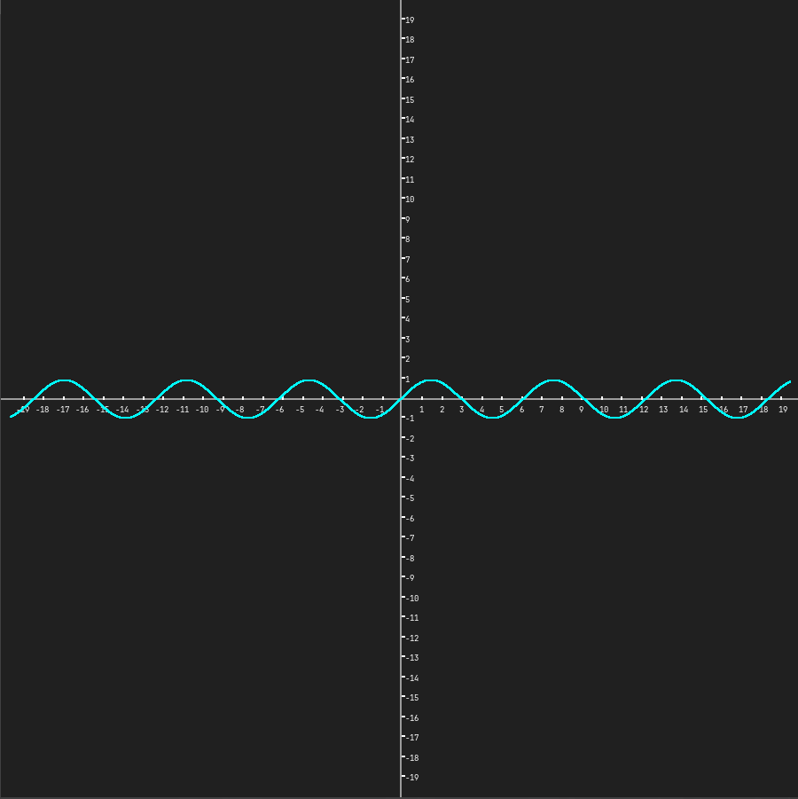

# Acerda De

Este proyecto es acerca de un aplicacion para renderizar el grafico de una funcion en un domino dado. Y tener un representacion del mismo impreso en pantalla.

# Librerias Utilizadas

- SDL2 utilizada para renderizar la funcion en una ventan.
- tinyexpr como parser de expresiones matematicas y evaluar en un cierto dominio.
- SDL2_ttf para poder renderizar texto en la ventana y agregar los numero del dominio e imagen en el eje cartesiono.

# Prerequsitos:

Se requiere tener instaladas las siguiente librerias para el uso y compilacion del proyecto.

- SDL2 (Depencia)
- SDL2_ttf (Depencia)

Con el siguiente comando se puede descargar en arch-linux:
```bash
sudo pacman -Sy sdl2 sdl_ttf
```

# Compilacion y Uso 

Para compilar el proyecto el repositorio cuenta con un makefile

## Compilacion
```bash
    make main
```

 Una vez compilado el proyecto el uso es el sigueinte:

## Ejemplo de Uso

```bash
    /.programa "sin(x)"
```


